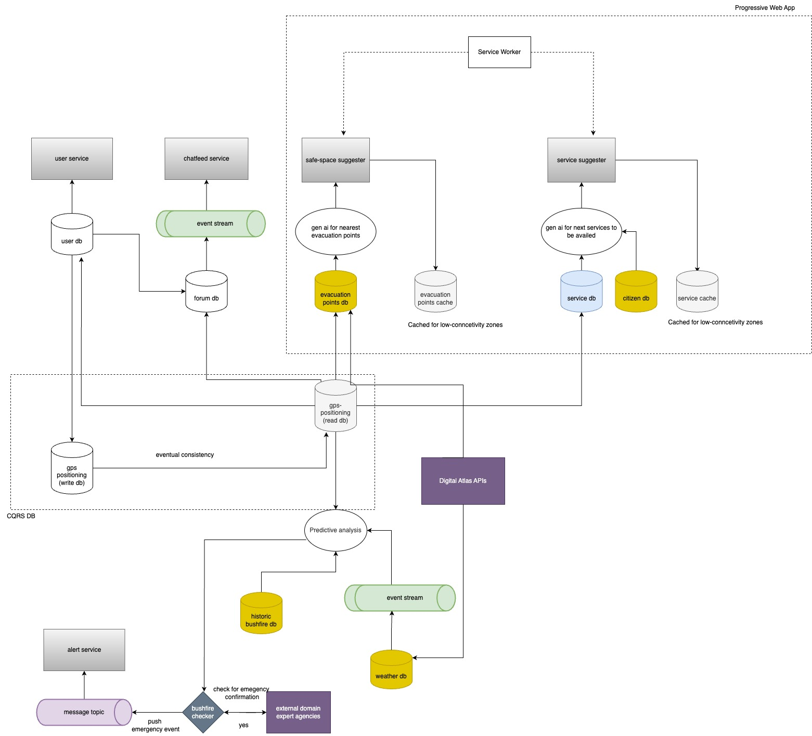
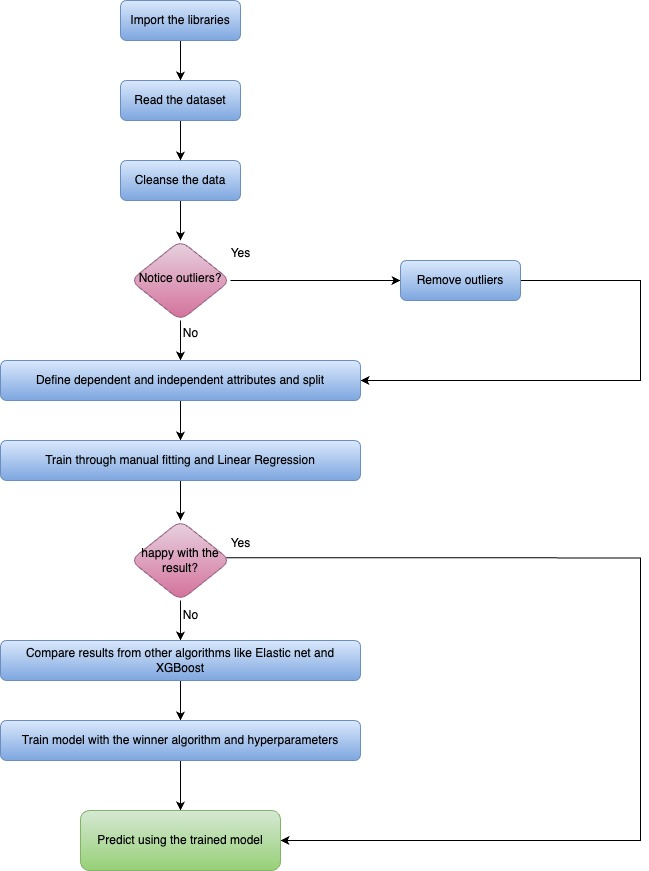

# Welcome to Haven

This app help individuals find a safe space during times of emergencies

In emergencies like bushfires, it's crucial to find safe spaces and stay informed about government services and entitlements. However, there is currently no system in place to notify individuals about the likelihood of disasters, evacuation points, or recovery options, such as grants, relief, and aftercare support. This can make navigating these resources especially difficult for people with special needs.

Our app solves these challenges by offering a one of a kind community-driven solution powered by Gen-AI and predictive analytics. Supported by Digital Atlas APIs, it not only helps people during crises but also guides them through the recovery process with clear next steps.

### System Design:

### Salient features:

#### Leveraging Gen AI and Predictive analysis

We leverage Gen-AI and predictive analytics to protect communities from future bushfires by providing real-time alerts on potential threats in their area. Our intelligent analysis engine processes historical bushfire data, geo-location information, and live weather updates through event streaming to predict the likelihood, severity, and proximity of upcoming bushfires.

In addition, our app offers personalized recommendations for safe spaces and evacuation routes, as well as guidance on next steps. Powered by Gen-AI, it analyzes data on evacuation points and local services to suggest the nearest exit and the most appropriate support services to access.

#### Unlocking the potential of Digital Atlas of Australia

We use Digital Atlas APIs to generate maps that users can access to locate evacuation points. Additionally, we utilize the datasets provided by Digital Accuracy for predictive analysis and insights.

#### Progressive Web App (PWA) for low connectivity zones

Our app operates in both online and offline modes, ensuring access to key services even with limited connectivity. Recommendations for evacuation points and essential services continue to work offline, utilizing service workers and a cached database that updates instantly once connectivity is restored. This approach addresses the issue of low connectivity during disasters. We employ a network-first strategy to provide users with the most current information whenever possible.

#### Event-driven

Our architecture is built on microservice and event-driven principles:

1. We utilize event streaming for the chat feed, ensuring eventual consistency and minimal latency for users. Weather data is also streamed in real-time to support accurate bushfire predictions.
2. Our bushfire prediction system follows a pub-sub model, where the engine listens for events and publishes them to relevant message topics.
3. We implement the CQRS pattern for our location database, with the user-service handling all database writes and a cached version maintained for read operations. This allows the app to function seamlessly in offline mode.

### Databases

#### User
Stores user attributes such as name, email, etc. Any PII data is either hashed or not stored in the database

#### Location
The user's GPS location is stored in a location database during sign-up, with the CQRS pattern ensuring that the write database is only accessed when the user signs up or manually updates their location. For all other read-related activities, a separate read database is utilized.

This approach also enhances the app's PWA functionality, allowing it to efficiently handle offline mode by using cached data for location-based services without needing constant access to the write database.

#### Forum 

This database will store user posts and feeds, utilizing event streaming internally to ensure low latency and eventual consistency.

_Note: Additionally cached evacuation and service databases are used to offer PWA_

### Datasets

#### Historic Bushfire Dataset 
This data set is collected from https://digital.atlas.gov.au/datasets/digitalatlas::historical-bushfire-boundaries-3/about. It is used to predict the bushfires.

#### Evacuation points
This data will ideally be gathered from the Digital Atlas to identify the nearest evacuation or relief centers based on the user's location.

#### Weather
This data will ideally be sourced from the Digital Atlas, providing users with attributes such as wind speed, direction, temperature, and humidity specific to their location.

#### Citizens
This dataset is collected from https://digital.atlas.gov.au/datasets/10992a67b43149fc9addc2b0a3ba5d4d_0/explore. This is used to offer personalised services (such as recommending government entitlements) for our users.

### Core Services:

#### User Service:

Used to create new users, get users, update and delete user. 

#### Feed Service

Used to create new feeds, get feeds, update and delete feeds. 

#### Safe Space Suggester

Predicts the likelihood of a bushfire and recommends evacuation points based on the user's location. This service operates in both online and offline modes.

#### Service Suggester

Recommends services tailored to the user's current situation. For example, it suggests grants or housing support for disaster victims in recovery, or emergency services if the user is caught in an active fire.

#### Alert Service

Sends in-app notifications to users when a bushfire is predicted. Our intelligent predictive analysis, driven by historical data, ensures accurate forecasting. After completing the analysis, we verify the results with external agencies, and if confirmed, an alert is issued to the user. Additionally, the app provides real-time weather updates based on the user's location during the emergency, ensuring they receive the most current information.

### Jupyter pipeline flowchart:

### Tools Used:

1. Jupyter notebooks using Python to analyse the data and gain insights
2. Swagger Codegen for auto-generation of client ans servers from openapi specification
3. Python and python based libraries

 
### Important Links

Dataset used:
https://digital.atlas.gov.au/datasets/digitalatlas::historical-bushfire-boundaries-3/about
https://digital.atlas.gov.au/datasets/digitalatlas::3-hourly-bushfire-accumulation/about?layer=3
https://digital.atlas.gov.au/datasets/10992a67b43149fc9addc2b0a3ba5d4d_0/explore
https://abs.gov.au/census/find-census-data/quickstats/2021/128021538

Drawio links:

https://drive.google.com/file/d/1EwtUMJB6naeb_ZSYn3BIT_HJjjWl-Uu9/view?usp=sharing
https://drive.google.com/file/d/1Qe1mxYLMKNGw6gAVxjVUiDwP1jcqsbuK/view?usp=sharing

